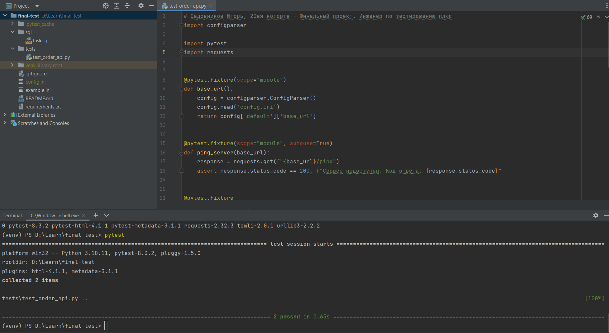

# Подключение к базе данных

Для успешного подключения к базе данных необходимо выполнить:

1. Аутентифицироваться на сервере с помощью команды:

```bash
ssh <id>@serverhub.praktikum-services.ru -p 4554
```

2. В открывшемся окне ввести команду для подключения к БД:

```bash
PGPASSWORD=smith psql -U morty -d scooter_rent
```


# Работа с базой данных

Для выполнения задания с помощью SQL-запросов выполнить следующие пункты:

1. Проверим таблицы `\dt`

2. Проверим таблицу заказов `\d "Orders"`

3. Выполним запросы, указанные в [файле](./sql/task.sql)


# Работа с автотестами

Для выполнения автоматических тестов необходимо:

1. Открыть проект в IDE (например PyCharm/VSCode)
2. Создать venv (виртуальное окружение) с помощью команды `python -m venv venv`
3. Открыть новый терминал, убедиться в настроенном venv
4. Установить библиотеки с помощью команды `pip install -r requirements.txt`
5. Заполнить файл config.ini по примеру из example.ini
6. Выполнить тесты командой `pytest`, либо, для генерации отчета выполнить `pytest --html=report.html`

Результат выполнения тестов

